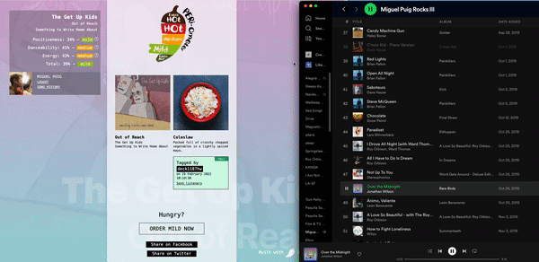

# Spotify - Nando's - Peri Mood

Find out the mood of your currently played Spotify song based on its valance, danceability, and energy.

Tag songs and find out some (random) food to order.

[https://perimood.miguelpuig.com/](https://perimood.miguelpuig.com/)

# Local development

## Option 1
### Server

`npm install`

`npm run dev`

### Client

`cd client`

`npm install`

`npm run serve`

Site available on [localhost:8081](http://localhost:8081)

## Option 2
### Docker

Build image

`docker build --no-cache . -t miguelpuig/mood`

Run Container

`docker run -p 8080:8080 -d --name nandos-mood miguelpuig/mood`

Site available on [localhost:8080](http://localhost:8080)

# Deploy 

Build client public folder

`npm run build-client`

Push changes to `main` branch

[Google Cloud Build Trigger](https://console.cloud.google.com/cloud-build/triggers/edit/00f1e6a3-ca33-4925-80ad-1cd419660d18?authuser=2&orgonly=true&project=miguelpuig-341508&supportedpurview=project)